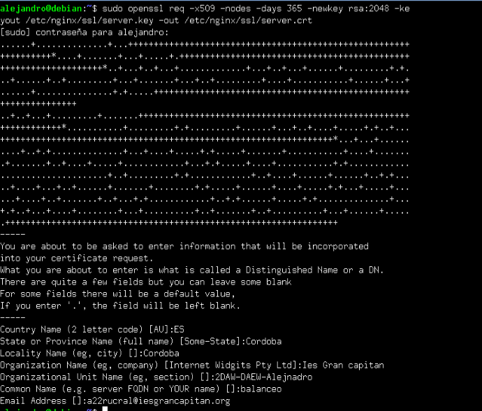
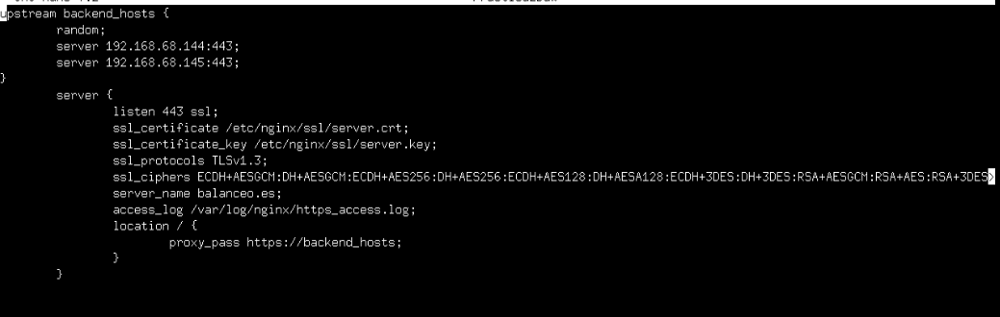
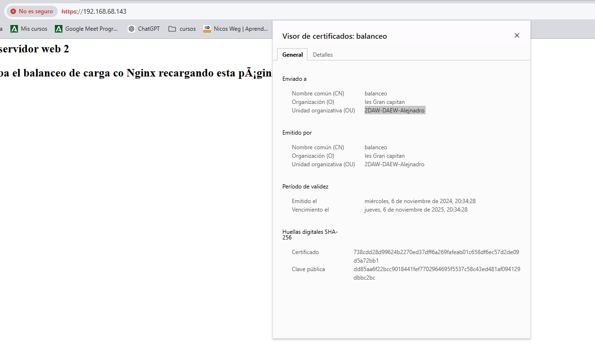
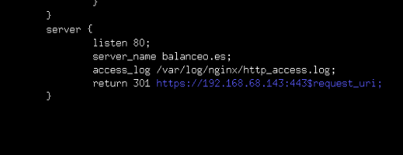
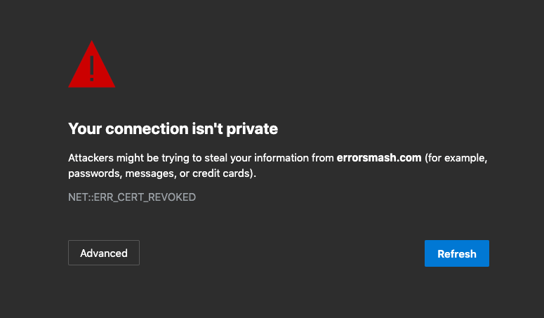

# Practica 2.5 Proxy Inverso y balanceo de carga con SSL en Nginx.
## Introducción. 
Una de las importantes funciones que tiene un proxy inverso era realizar un cifrado y descifrado de SSL para utilizar HTTPS en los servidores web. 


El tráfico de red entre el balanceador de carga y los servidores va sin cifrar (HTTP). Esto se debe a que normalmente en un caso real, el proxy y los servidores, además de estar en la misma red privada suelen estar administrados por la misma empresa, por lo que no supone un peligro ese tráfico sin cifrar. 

### Certificados
HTTPS se basa en el uso de certificados digitales. Cuando accedemos a una web mediante HTTPS, nos presenta un certificado digital para asegurar de ser quien dice ser. La validez de este certificado se verifica en la Autoridad de Certificación que emitió ese certificado si es válido. Los navegadores web tienen precargadas las Autoridades de Certificación en las que confían por defecto a la hora de navegar por web HTTPS.

En caso de que no tenga certificado o no lo haya firmado la CA, nos saltará un aviso de que la página web no es segura.

## Tarea.
Esquema objetivo de  la practica:


### Creación de certificado autofirmado. 
Nosotros no utilizaremos certificados CA ya que nuestros servicios no está publicados en internet y esos certificados son de pago. Para su simulación los crearemos y firmaremos nosotros mismos. 
Para empezar, crearemos el directorio **ssl** en la carpeta **nginx**: 

```
cd /etc/nginx
mkdir ssl
```

Tras esto pondremos el siguiente comando para crear el certificado y las claves;

```
sudo openssl req -x509 -nodes - days 365 -newkey rsa:2048 -keyout /etc/ngix/ssl/server.key -out /etc/nginx/ssl/server.crt

```



Si todo esta escrito correctamente. Como vemos en la imagen deberemos introducir unos parametros para el certificado. Como nuestra ciudad, email, centro...

#### Desglose de comando. 
- openssl: herramienta por linea de comandos para crear y administrar certificados u otros archivos OpenSSL
- req: subcomando utilizado para generar solicitud de certificados.
- -x509: Esto modifica el subcoando anterior al decirle que queremos crear un certificado autofirmado en lugar de solicitud de firma de certificado. 
- -nodes: Esto le dice a OpenSSL que omita la opcion de asegurar nuestro certificado con contraseña. Ya que necesitamos que nginx lo lea sin intervención del usuario.
- -days 365: Aquí definimos el tiempo que será válida la clave. 
- -newkey rsa:2048: Esto especifica que queremos crear un nuevo certificado y una nueva clave al mismo tiempo. 
- -keyout: Este parametro indica dónde colocar el archivo de clave privada. 
- -out: Esto le dice a OpenSSL dónde colocar el certificado que estamos creando. 

### Configuración SSL en el Proxy inverso.
Ya visto anteriormente, nos iremos al archivo de configuración del proxy ubicado en la ruta /etc/nginx/sites-avaliable. Este archivo lo editaremos para poner la configuración para que el acceso al sitio web se realice mediante SSL. 

Dentro del bloque server{...}, cambiaremos el puerto de escucha **listen 80** por lo que veis en la imagen de abajo. Quedará tal que así: 



#### Desglose de configuración. 

Le estamos diciendo que escuche por el puerto 443, que es el puerto por defecto de HTTPS. Le hemos indicado el directorio donde está el certificado y la clave que hemos generado anteriormente. 
Los protocoloes y tipos de cifrado que pueden utilizar y por último el archivo donde se guardan los logs cambia de nombre, ahora será https_access.log. 

Tras este cambio de configuración resetearemos el servicio de Nginx. 

```
sudo systemctl restart nginx

```

### Comprobaciones. 
Si accedemos ahora al balanceador, la primera vez nos dará un aviso ya que el certificado es autofirmado. Aceptaremos el riesgo y recargamos repetidamente la página web con F5 vereis que el balanceo de carga se hace correctamente accediendo mediante https. 
Para ver los detaller del certificado, le daremos click a conexión no segura, se nos despegará un menú y le daremos a la opción de **detalles de certificado** y nos saldrá nuestro certificado con los datos introducidos. 



### Redirección forzosa a HTTPS. 
Para que, indistintivammente de la forma por la que accedamos al sitio web balanceo siempre fuerce a utilizar  HTTPS, necesitaremos configuración adicional. Añadiremos un bloque de server que se quede tal que así: 




Con esto indicamos que escuche el puerto 80, que se guarde los logs de este bloque en ese directorio y con ese nombre. Cuando se reciba una petición con las dos condiciones anteriores, se devuelve un código HTTP 301:  
-   HTTP 301 Moved Permanently: Es un código de estado de HTTP que ha habido comunicación entre el host y el servidor pero que el recurso solicitado ha sido movido a otra dirección permanentemente. Es muy importante configurar estas redirecciones en los sitios web. 

En conclusión, este bloque hace que cuando se reciba una petición HTTP (con el puerto 80) la redirija a HTTPS. 

## Cuestiones. 
1. Hemos configurado nuestro proxy inverso con todo lo que nos hace falta pero no nos funciona y da un error del tipo This site can't provide a secure connection, ERR_SSL_PROTOCOL_ERROR.

Dentro de nuestro server block tenemos esto:

```
server {
    listen 443;
    ssl_certificate /etc/nginx/ssl/enrico-berlinguer/server.crt;
    ssl_certificate_key /etc/nginx/ssl/enrico-berlinguer/server.key;
    ssl_protocols TLSv1.3;
    ssl_ciphers ECDH+AESGCM:DH+AESGCM:ECDH+AES256:DH+AES256:ECDH+AES128:DH+AES:ECDH+3DES:DH+3DES:RSA+AESGCM:RSA+AES:RSA+3DES:!aNULL:!MD5:!DSS;
    server_name enrico-berlinguer;
    access_log /var/log/nginx/https_access.log;

    location / {
        proxy_pass http://red-party;
        }
    }

```

Añadiremos ssl tras 443 para indicarle que este bloque esta configurado para ssl. Solución. 

```
server {
    listen 443 ssl;
    ssl_certificate /etc/nginx/ssl/enrico-berlinguer/server.crt;
    ssl_certificate_key /etc/nginx/ssl/enrico-berlinguer/server.key;
    ssl_protocols TLSv1.3;
    ssl_ciphers ECDH+AESGCM:DH+AESGCM:ECDH+AES256:DH+AES256:ECDH+AES128:DH+AES:ECDH+3DES:DH+3DES:RSA+AESGCM:RSA+AES:RSA+3DES:!aNULL:!MD5:!DSS;
    server_name enrico-berlinguer;
    access_log /var/log/nginx/https_access.log;

    location / {
        proxy_pass http://red-party;
        }
    }

```


2. Imaginad que intentamos acceder a nuestro sitio web HTTPS y nos encontramos con el siguiente error:



Este aviso se produce cuando el navegador encuentran problemas con el certificado SSL de un sitio web, generalmente porque no provienen de la CA. La solución sería contratar los servicios y obtener un certificado de la CA. 